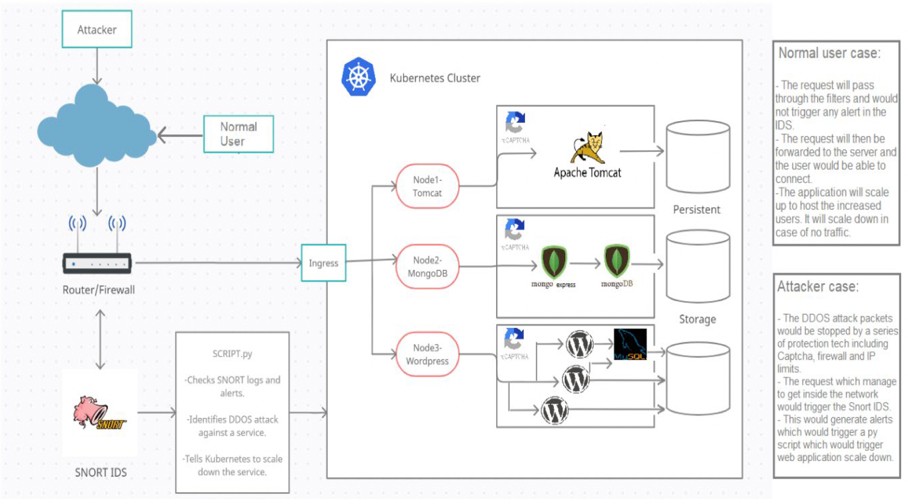
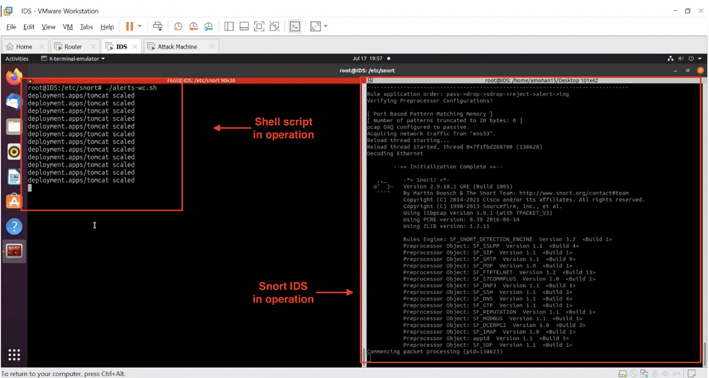
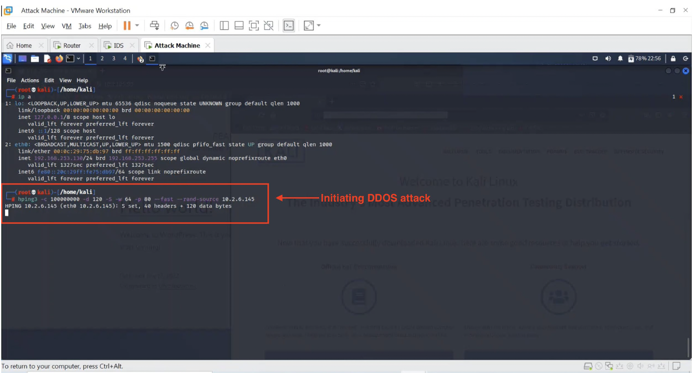
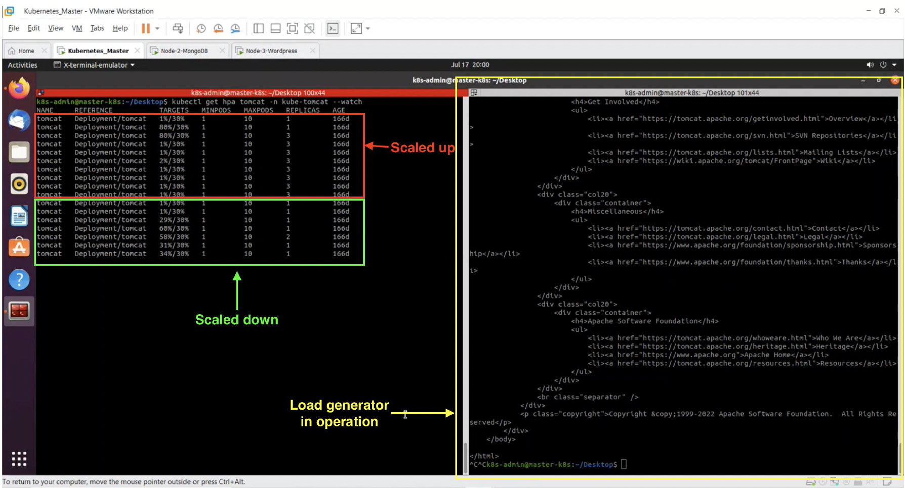

# Kubernetes DoS Attack Detection & Automated Resource Protection

A defensive cybersecurity project demonstrating automated detection and response to a **SYN-flood denial-of-service (DoS) condition** targeting services running in a multi-node Kubernetes environment.

The project integrates **Kubernetes, Snort IDS, Linux, Python, SSH automation, and log analysis** to detect suspicious traffic and automatically reduce the number of running application replicas when a targeted service is identified.

> **Project status:** Academic / research prototype
> **Original implementation:** VMware-based x86 virtual machines
> **Current repository:** Source code, configuration examples, architecture, screenshots, and implementation documentation

---

## Overview

The goal of this project was to explore how an intrusion detection system could be connected to an automated defensive response mechanism in a Kubernetes environment.

The prototype follows this general workflow:

```text
Attack Traffic
      │
      ▼
   Router
      │
      ├──────────────► Kubernetes Cluster
      │
      ▼
   Snort IDS
      │
      ▼
 Snort Alert Log
      │
      ▼
 Alert Trigger Script
      │
      ▼
 Prevention / Parsing Script
      │
      ▼
 Identify Targeted Service
      │
      ▼
 SSH → Kubernetes Master
      │
      ▼
 Scale Target Deployment
      │
      ▼
 Reduce Resource Consumption
```

The system was tested using a SYN-flood traffic scenario generated from a controlled Kali Linux environment.

---

## Architecture

The original environment consisted of a four-node Kubernetes cluster with an IDS positioned in the traffic path.



### Kubernetes Environment

The cluster consisted of:

* **Master / Controller Node**

  * Kubernetes control-plane functions
  * Receives automated response commands

* **Application Node**

  * Docker / Apache Tomcat workload

* **Application Node**

  * WordPress workload

* **Database Node**

  * MongoDB workload

Traffic entered through a router and was forwarded to the appropriate Kubernetes service.

A separate IDS VM monitored the traffic and generated alerts using Snort.

---

## Detection



### Snort IDS

Snort was configured with a local detection rule for the SYN-flood test scenario.

The IDS inspected network traffic and generated alerts when traffic matching the configured detection criteria was observed.

Example configuration is provided in:

```text
snort/local.rules
```

The Snort configuration included information such as:

* Alert priority
* Timestamp
* Source IP
* Destination IP
* Destination port
* Protocol / traffic characteristics

These fields were subsequently consumed by the automated response script.


---

### Alert Trigger

The alert trigger script continuously monitored the Snort log for newly generated alerts.

Its basic workflow was:

1. Monitor the Snort alert log.
2. Detect newly appended entries.
3. Trigger the Python prevention script.
4. Pass the newly generated alert information for analysis.

The implementation is provided in:

```text
scripts/alert_trigger.sh
```

This component acts as the bridge between the IDS and the automated response mechanism.


---

## Automated Response

The Python prevention script parses the relevant Snort alert information.

The parser extracts information such as:

* Timestamp
* Alert priority
* Source IP
* Destination IP
* Target information

The script then determines which Kubernetes service is associated with the detected malicious traffic.

Once the targeted service is identified, the script establishes an SSH connection to the Kubernetes master node and executes the appropriate Kubernetes scaling command.

The prototype scales the affected deployment down to its configured minimum replica count.

The implementation is provided in:

```text
scripts/prevention.py
```

### Response Concept

```text
Snort Alert
    ↓
Parse Alert
    ↓
Identify Target
    ↓
Map Target → Kubernetes Service
    ↓
SSH to Kubernetes Controller
    ↓
Scale Deployment
```

The purpose of this response was to demonstrate automated resource-protection logic rather than provide a complete production-grade DDoS mitigation system.

---

## Test Scenario

The system was tested using a controlled SYN-flood scenario generated from a Kali Linux machine.



The test traffic was directed toward the Kubernetes environment while Snort monitored the traffic.

The resulting workflow demonstrated:

1. SYN-flood traffic generation
2. Snort detection
3. Alert creation
4. Alert trigger detection
5. Python log parsing
6. Identification of the targeted service
7. SSH-based communication with the Kubernetes controller
8. Automated scaling response



---

## Repository Structure

```text
.
├── README.md
├── scripts/
│   ├── alert-trigger.sh
│   └── prevention.py
├── snort/
│   └── local.rules
├── examples/
│   └── syn-flood-test.txt
├── docs/
│   ├── architecture.png
│   ├── detection-flow.png
│   ├── attack-test.png
│   ├── snort-alert.png
│   ├── prevention-script.png
│   └── kubernetes-response.png
└── reports/
    └── project-report.pdf
```

---

## Technologies

* Kubernetes
* Docker
* Snort IDS
* Python
* Bash
* Linux
* SSH
* Kali Linux
* VMware
* Apache Tomcat
* WordPress
* MongoDB
* Network security monitoring
* Log analysis
* Automated incident response

---

## Security Concepts Demonstrated

This project explores several security engineering concepts:

* Intrusion Detection
* Network Traffic Analysis
* DoS Detection
* Security Alert Processing
* Log Parsing
* Automated Incident Response
* Kubernetes Security
* Containerized Workloads
* Network Segmentation
* Infrastructure Automation
* Resource Protection
* Security Monitoring

---

## Design Considerations & Limitations

This implementation was developed as an academic security engineering prototype and should not be considered a production-ready DDoS mitigation platform.

Several improvements would be required for production deployment, including:

* More robust detection logic
* Rate-based and behavioral detection
* Alert correlation
* False-positive handling
* Authentication and authorization hardening
* Secure secret management
* API-based Kubernetes interaction instead of direct SSH automation
* Kubernetes-native security controls
* Network-level traffic filtering
* Distributed detection
* High-availability response mechanisms
* Comprehensive audit logging
* Automated rollback mechanisms
* Protection against attacker-generated alert floods

The scaling response demonstrated here is intended primarily to illustrate the **integration between security detection and automated infrastructure response**.

---

## Why This Project Matters

The interesting aspect of this project is not simply detecting a SYN flood.

It demonstrates a complete defensive workflow:

**Detect → Analyze → Identify → Respond**

The project explores how security telemetry can be converted into an automated infrastructure action, connecting traditional network intrusion detection with container orchestration and infrastructure management.

This provides a foundation for more sophisticated security automation and incident-response architectures.

---

## Evidence & Documentation

The `docs/` directory contains screenshots and supporting material from the original implementation, including:

* Architecture
* Kubernetes cluster configuration
* Snort detection
* Attack simulation
* Alert generation
* Python parsing
* Automated response
* Kubernetes scaling behavior

The project was originally implemented and tested using an x86 VMware-based environment.

The repository preserves the implementation and evidence from that environment rather than attempting to reproduce the original virtualized infrastructure on a different host architecture.

---

## Disclaimer

This project is intended for **authorized security research, education, and defensive testing only**.

Traffic-generation and attack-simulation components should only be used against systems and networks where the operator has explicit authorization to perform security testing.
